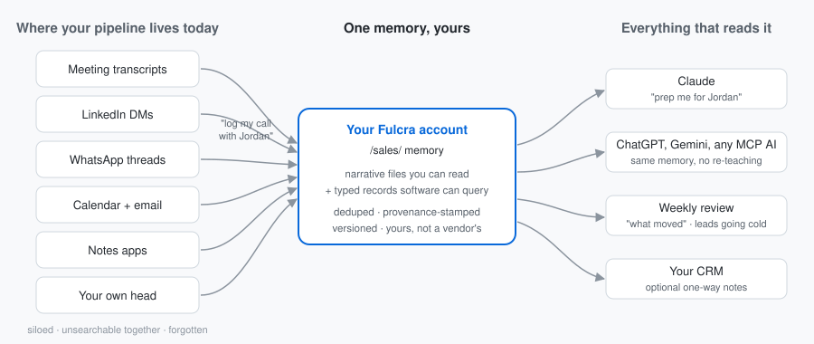

# Fulcra Sales Memory

Two Claude skills that give your sales pipeline a memory, on your own [Fulcra](https://fulcra.ai) account. Fulcra is a personal context platform: your account holds your data — calendars, files, custom records — and any AI assistant you connect to it over MCP reads and writes that same account. Every customer conversation you log — an inbound lead, a discovery call, a pricing follow-up — is stored twice: a narrative entry you can read, and a typed record software can query. From there: recall before the next meeting ("prep me for Jordan"), account history ("have we talked to Brightpath before?"), momentum review ("what moved this week", grouped by account with stage changes per your notes), and a list of leads going cold (45+ days). Optional one-way copy into your CRM. Because the memory lives in your account rather than inside any one chat product, it persists across sessions and across assistants — the whole pipeline, remembered.

**Sibling packets**: [fulcra-dealflow-memory](https://github.com/keng009/fulcra-dealflow-memory) (investors managing deal flow — the engine's origin) and [fulcra-raise-memory](https://github.com/keng009/fulcra-raise-memory) (founders raising) are the same engine flavored for different sides of different tables. All three can run on one account (disjoint `/dealflow/`, `/raise/`, and `/sales/` namespaces). See [ADR-0007](docs/adr/0007-sibling-product-fork.md).

## Not technical? Start here

You don't need to know what any of the words below mean. Setup is three clicks and a free account; after that you talk to Claude in plain sentences — **"prep my day"**, **"log my call with Sam"**, **"what do I owe people"**, **"what moved this week"**. The whole manual fits on one page: [docs/quick-reference.md](docs/quick-reference.md). Everything else in this README is for people who want to know how it works.

## Which skill do I install?

| You want | Install | Commitment |
|---|---|---|
| A zero-commitment look — see the flow on your own month (or sample data), decide after | **`sales-demo`** | ~10 minutes; works on an empty account; nothing written until you say yes |
| The product — ongoing capture, meeting prep, weekly momentum, going-cold alerts, CRM sync | **`sales-memory`** | The daily workflow; picks up anything the demo stored, no migration |
| A CRM connected and structured for the above — or set up from scratch | **`crm-setup`** | ~15 minutes, optional; Attio first, HubSpot and Notion designed-for |

Start with the demo if you're deciding; start with `sales-memory` if you're already sold. Both write the same formats to the same folder.

## See it in 10 minutes — `sales-demo`

One guided session — about ten minutes once installed. The skill inspects your Fulcra data catalog, builds a **read-only snapshot of your last 30 days of customer conversations** from whatever you've connected (calendar, meeting tools), saves it as memory on a single yes — files versioned; the full skill adds a veto flow that can strike any saved item later — and generates a prep brief from what it just stored. Nothing is written until you say so; with no sources connected, it falls back to capturing one conversation conversationally. Think of it as the hello-world; `sales-memory` below is the product.

1. Create a Fulcra account at [fulcra.ai](https://fulcra.ai) if you don't have one. An empty account is fine — the demo works without prior data.
2. In Claude, open **Customize → Connectors** and connect **Fulcra**. First time, or using an agent harness instead of Claude's app? [Connecting Fulcra](skills/sales-memory/references/connect-fulcra.md) has both paths — and points at Fulcra's official `fulcra-get-started` skill, which lets your agent drive the connection.
3. Download `sales-demo.zip` from the [latest release](https://github.com/keng009/fulcra-sales-memory/releases/latest) (or zip the `skills/sales-demo` folder yourself) and upload it in Claude under **Customize → Skills → + Create skill → Upload a skill**. If Skills isn't visible, enable it under **Settings → Capabilities** first.
4. Start a new chat and say: **"run the Fulcra sales demo"**.

## Make it your workflow — `sales-memory`

The ongoing version: log customer conversations as they happen, prep before meetings, review the week by account, catch leads going cold before the deal loses momentum.

1. Same Fulcra account and connector as above.
2. Download `sales-memory.zip` from the [latest release](https://github.com/keng009/fulcra-sales-memory/releases/latest) (or zip the `skills/sales-memory` folder — its `references/` subfolder must travel inside the zip) and upload it the same way.
3. Say **"show me my last 30 days"**, **"log my call with Jordan"**, **"have we talked to this company before?"**, **"prep me for tomorrow"**, **"what moved this week"**, or **"which leads have gone cold"**.

Only the Fulcra connector is required. If calendar data is reachable (in your Fulcra account or via a Claude calendar connector), the skill detects and uses it: conversations get corroborated against real meetings, and "prep me for tomorrow" reads the actual calendar. If a transcript tool (Otter, Zoom, Fireflies) is connected, it can log meetings straight from transcripts; opt into `email` and the sweep reads your mailbox for real conversations too (notifications are surfaced as signals, never logged as conversations). Paste a lead's WhatsApp, LinkedIn, or iMessage thread and "log this" captures it too — and inbound product signals (a signup notification, a demo request, a trial-started email) are lead sources like any other: paste one and log it. Nothing to configure — each session it states what it found.

Both skills write the same formats to the same `/sales/` folder in your account, so anything you logged during the demo is picked up by the full skill as-is. No migration.

## Bring your CRM — `crm-setup` (optional)

Sales memory needs no CRM — Fulcra alone is the system of record for conversations. When you want one anyway (a board view, a teammate on the pipeline), `crm-setup` connects it and gives it a lean structure in four phases: **Connect** (the exact account and connector steps for Attio, HubSpot, or Notion, then a verified workspace), **Inspect** (what the workspace already holds — never assumed empty), **Build** (a pipeline whose stages mirror `sales-memory`'s vocabulary — Lead → Qualified → Demo → Proposal → Negotiation → Closed won / Closed lost — with the connector doing what it can and you doing the two-minute stage edit the connector can't, read back afterward), and **Hand off** (the stage map recorded in your Fulcra handoff file, and `sales-memory` ready to sync). It creates structure only — never contacts, deals, or notes — and lists every write before one yes. Download `crm-setup.zip` from the same release page and upload it the same way.

## What this looks like in real life

Founder-led sales generates exactly the interaction sprawl this pattern was built for: signups landing in your inbox, demos booked by three different schedulers, buyers who reply on LinkedIn, champions who only answer on WhatsApp — and a founder who has to remember what every one of them asked, objected to, and was promised, across months, while building the product. The memory lives in your account, not a vendor's, so it survives tool changes and works from every assistant you use.

Illustrative output — the demo generates one of these from your own logged conversation:

> **Prep brief — Jordan Lee (Brightpath Software)**
> **Who:** Head of Ops at Brightpath; discovery call in August. Process-minded, asked sharp security questions.
> **Last touchpoint:** call, Aug 20 — rollout discussion.
> **Stage noted (last):** proposal — per your notes.
> **Open follow-ups:** you owe them pricing and the security overview.
> **Talking points:** the ops-team intro Jordan offered; the security review they flagged as the deciding factor.

## Already have a CRM?

Keep it. If your Claude has CRM tools connected, `sales-memory` offers — once per session, never requires — to copy each logged conversation into it as a note on the matched contact. One-way, notes and tasks: it never edits fields, stages, or amounts, so your CRM stays the system of record for pipeline. One thing this flavor adds, because new leads often aren't in a seller's CRM yet: it can also add a missing lead as a minimal contact — but only if you turn that on, and it confirms each one first (off by default; [ADR-0008](docs/adr/0008-gated-crm-contact-creation.md)). Adapters are capability-based — see [`skills/sales-memory/references/crm-sync.md`](skills/sales-memory/references/crm-sync.md) for the tiers, the tested reference (Attio — sync, dedupe, and import live-tested under this flavor on 2026-09-15), and the 10-minute protocol for adding your own CRM. No CRM yet, or one without a pipeline? The `crm-setup` skill above gets you there. Your CRM is never mirrored into Fulcra: the memory holds the leads and customers you're actually talking to, not a copy of a thousand-contact list. (Individual CRM notes about those people can be imported as touchpoints on your say-so — selection, never mirroring.)

## Extend it — your messaging app, notetaker, or CRM

Everything here detects tools by capability, so an app that isn't named still works — paste a thread from any messenger and it logs. To make a source official (a paste-format row for Messenger or Signal, connector slots for a Telegram or iMessage reader, a new notetaker's timezone quirk, a calendar surface, or a CRM), [`references/extending.md`](skills/sales-memory/references/extending.md) has the per-source slots, the test to run, and the one PR to open. No claims without a testing row — "designed-for, untested" is an honest label here.

## Why Fulcra?

Because a pipeline runs for months across dozens of threads, and memory that lives inside one chat product is a silo. These skills use Fulcra as the account-level store that makes the rest honest: versioned files you can read, typed records software can query, and — the load-bearing part — **the same memory readable from every assistant you connect over MCP**. Where Fulcra is necessary, where it's merely convenient, and where the platform has limits the skills admit to: [docs/why-fulcra.md](docs/why-fulcra.md).

## Privacy

These skills are instruction files: no backend of their own, no telemetry, nothing that reports back to the authors. They write to exactly two places in your Fulcra account: files under `/sales/`, and typed records in the **Sales Touchpoint** data type they create — plus, only if you accept the offer, notes in your own CRM (and, only under the opt-in per-contact flow of ADR-0008, a minimal contact for a missing lead). Reads are wider but write nothing: with a calendar, transcript tool, or CRM connected, the snapshot reads recent events, transcripts, and CRM notes in its window to build what it shows you — whether or not you ever accept CRM sync. Your mailbox is read only if you opt a pipeline into `email` (or ask for an email sweep): thread headers and bodies in the sweep window, distilled into summaries, never sent, replied to, or labeled ([ADR-0010](docs/adr/0010-email-as-a-source.md)). They never write credentials or secrets to any file and never send email or messages on your behalf: ask for a follow-up and you get a clearly labeled draft. File deletes in Fulcra are soft; typed records have no per-record delete — a vetoed item is excluded from every read these skills perform but remains stored (other assistants reading the account should honor the `## Vetoed keys` list, which the contract documents), and the skills say so rather than pretending otherwise.

## Status — honest and current

This packet was forked 2026-08-31 from the engine of [fulcra-dealflow-memory](https://github.com/keng009/fulcra-dealflow-memory), whose write paths are live-tested with dated evidence (snapshot→commit→veto, stable per-source dedupe keys, CRM import + circularity, partial-failure healing, live sweep — see its [testing matrix](https://github.com/keng009/fulcra-dealflow-memory/blob/main/docs/testing.md)). **v0.2.0 (2026-09-15)** — live-tested on a real account: the demo through Claude's real skill-upload UI, snapshot → commit → veto, Attio and HubSpot sync with import guards, unattended auto-log from transcripts, calendar and email, and a scheduled sweep built by the skill — see [docs/testing.md](docs/testing.md) for every row, including what is still designed-but-untested (CRM contact creation, `crm-setup`'s structure build, messaging connectors, Notion, the coexistence rule).

---

MIT — see [LICENSE](LICENSE). Maintained by Nick Kengmana, Fulcra.
